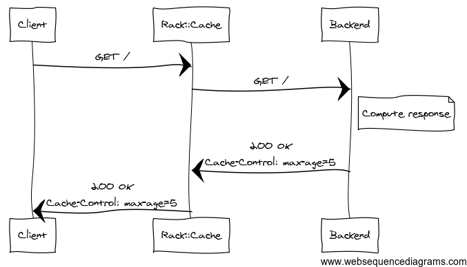

# Rack

## Abstract

Rack is is the powerful tool that our favorite ruby web frameworks are built on, but how much do you know about how it works? In the first part of the talk we'll look at the anatomy Rack and how it's simple composeable interface can be leverage to make our Ruby web apps better.  In doing so we'll see how simple it is to get a Rack application up and running.

We'll then look at a number of real world examples of how Rack and Rack Middleware can be used to elegantly solve problems, speed up your applications, improve your development environment, and clean up your application code.

Caleb Woods especially enjoys solving business problems with technology in a lean approach.  At RoleModel Software he works with clients solving problems with Ruby and Service Oriented Architecture.  Caleb is also passionate about mentorship and is always looking for ways to teach and learn from other developers.


-- Run through notes --

Diagram of Rack app
Diagram of Rack stack with middleware
Default stack, Sinatra stack, Rails Stack
Where is the next request called in the middleware
Timing as an example to show details
Ephisize should be can used in any Rack app

Start with stack then getting into how Rack works and build from there

example of basic auth - middleware that can take params

use Rack::Auth::Basic do |username, password|
  username == 'admin' && password == 'secret'
end

--- implemented ---

Example of environment
How to start - booting etc
Where to put middleware in a Rails app
Put examples in a directory
Types of status, headers, body

!SLIDE

# Rack

!SLIDE left

## What is Rack

Rack provides a minimal interface between webservers supporting Ruby and Ruby frameworks.

Source: [http://rack.github.io](http://rack.github.io)

!NOTES

Rack::Lint
http://yeahnah.org/files/rack-presentation-oct-07.pdf

!SLIDE left

## What does that mean?

Unified interface for all Ruby webservers to implement.

* [WEBrick](http://www.ruby-doc.org/stdlib-2.0/libdoc/webrick/rdoc/WEBrick.html)
* [Unicorn](https://github.com/defunkt/unicorn)
* [Thin](http://code.macournoyer.com/thin/)
* [Puma](http://puma.io/)

!SLIDE left

## [Rack Spec](http://rack.rubyforge.org/doc/SPEC.html)

* Ruby object that responds to `call`
* Take 1 argument the `environment` [Hash]
* Returns an Array with 3 values: status, headers, and body
  * status [Integer] - 1xx, 2xx, 3xx, 4xx, 5xx
  * headers [Hash] - { 'Content-Type' => 'text/plain' }
  * body [Enumerable] - responds to `each`

!SLIDE left snippet

## Simplest Example

```ruby
# examples/1/config.ru

run lambda { |env| [200, {}, ['Hello World!']] }
```

```bash
$ cd examples/1
$ rackup -p 5000
```

<div class="run-example">
  <span>curl -i localhost:5000</span>
  <button class="clear">Clear</button>
  <button class="run">Run</button>
  <div class="result"></div>
</div>

!NOTES

* Lambda responds to call
* `body` is an Array because it needs to respond to each

!SLIDE diagram

## Simplest Example

# TODO diagram of simple example

!SLIDE left

## Environment

```ruby
{ "SERVER_SOFTWARE" => "thin 1.5.1 codename Straight Razor",
  "SERVER_NAME" => "localhost",
  "rack.input" => #<Rack::Lint::InputWrapper:0x007ff37cf1aa28 @input=#<StringIO:0x007ff37ceca730>>,
  "rack.version" => [1, 0],
  "rack.errors" => #<Rack::Lint::ErrorWrapper:0x007ff37cf1a3e8 @error=#<IO:<STDERR>>>,
  "rack.multithread" => false,
  "rack.multiprocess" => false,
  "rack.run_once" => false,
  "REQUEST_METHOD" => "GET",
  "REQUEST_PATH" => "/",
  "PATH_INFO" => "/",
  "REQUEST_URI" => "/",
  "QUERY_STRING" => "",
  "SERVER_PORT" => "5000",
  "SERVER_PROTOCOL" => "HTTP/1.1",
  "SCRIPT_NAME" => "",
  "HTTP_VERSION" => "HTTP/1.1",
  "HTTP_HOST" => "localhost:5000",
  "HTTP_CONNECTION" => "keep-alive",
  "HTTP_CACHE_CONTROL" => "max-age=0",
  "HTTP_ACCEPT" => "text/html,application/xhtml+xml,application/xml;q=0.9,image/webp,*/*;q=0.8",
  "HTTP_USER_AGENT" => "Mozilla/5.0 (Macintosh; Intel Mac OS X 10_8_4) AppleWebKit/537.36 (KHTML, like Gecko) Chrome/31.0.1612.2 Safari/537.36",
  "HTTP_ACCEPT_ENCODING" => "gzip,deflate,sdch",
  "HTTP_ACCEPT_LANGUAGE" => "en-US,en;q=0.8",
  # ...
```

!SLIDE left snippet

## Middleware

* Allows composition of a stack of Rack applications
* [Rack::Build](http://rack.rubyforge.org/doc/Rack/Builder.html) provides a small DSL to this
* Same spec, but adds an initializer that takes next app in stack

```ruby
# middleware are declared as a class not an instance

use FirstMiddleware
use SecondMiddleware
run Application.new
```

!SLIDE left

## Middleware

```ruby
# examples/3/config.ru

class ContentLengthMiddleware
  def initialize(app)
    @app = app
  end

  def call(env)
    status, headers, body = @app.call(env)
    headers['Content-Length'] = body.inject(0) do |l, p|
      l + Rack::Utils.bytesize(p)
    end.to_s
    [status, headers, body]
  end
end

use ContentLengthMiddleware
run lambda { |env| [200, {}, ['Hello World!']] }
```
<div class="run-example">
  <span>curl -i localhost:5200</span>
  <button class="clear">Clear</button>
  <button class="run">Run</button>
  <div class="result"></div>
</div>

!SLIDE diagram

## Middleware

# TODO diagram of middleware call stack

!SLIDE left

## $ rake middleware

```ruby
# rails 4 app with Devise
use ActionDispatch::Static
use Rack::Lock
use #<ActiveSupport::Cache::Strategy::LocalCache::Middleware:0x007ff9c2f32d48>
use Rack::Runtime
use Rack::MethodOverride
use ActionDispatch::RequestId
use Rails::Rack::Logger
use ActionDispatch::ShowExceptions
use ActionDispatch::DebugExceptions
use ActionDispatch::RemoteIp
use ActionDispatch::Reloader
use ActionDispatch::Callbacks
use ActiveRecord::Migration::CheckPending
use ActiveRecord::ConnectionAdapters::ConnectionManagement
use ActiveRecord::QueryCache
use ActionDispatch::Cookies
use ActionDispatch::Session::CookieStore
use ActionDispatch::Flash
use ActionDispatch::ParamsParser
use Rack::Head
use Rack::ConditionalGet
use Rack::ETag
use Warden::Manager
run Sample::Application.routes
```

!SLIDE left snippet

## Adding Middleware - config.ru

```ruby
require 'server'
require 'middleware/custom_middleware'

use CustomMiddleware
run Server.new
```

!SLIDE left

## Adding Middleware - Rails

```ruby
# config/application.rb

require 'middleware/custom_middleware' # pulling from lib/middleware
# ...

module Sample
  class Application < Rails::Application
    # ...
    config.middleware.use CustomMiddleware # last on stack
    config.middleware.insert 0, CustomMiddleware # first on stack
    config.middleware.insert_before ActionDispatch::Head, CustomMiddleware
    config.middleware.insert_after ActionDispatch::Head, CustomMiddleware
    config.middleware.swap ActionDispatch::Flash, CustomMiddleware
    config.middleware.delete ActionDispatch::Flash
  end
end

# config/envronments/development.rb

Sample::Application.configure do
  config.middleware.use CustomMiddleware
end
```

!SLIDE left snippet

## Rails Router

The [Rails Router](https://github.com/rails/rails/blob/master/actionpack/lib/action_dispatch/routing/mapper.rb) uses the same principle, every action is Rack app

```ruby
# This standard route
get "/", to: "posts#index"

# maps to
get "/", to: PostsController.action(:index)
```

!SLIDE left

## Rails Router

* Match (get, post, ..) - matches on full path
* Mount (SintraApp) - matches on the path prefix

```ruby
# REQUEST: GET /sinatra/sub_route

get "/sinatra/specific", to: "posts#index"

mount SintraApp, at: "/sinatra"

# other uses
mount Sidekiq, at: "/sidekiq"
mount Grape::API, at: "/api"
```

!SLIDE

}}} images/field.jpg::http://www.flickr.com/photos/arturstaszewski/7048604301

# Rack in the "field"

!SLIDE diagram

## Normal API POST Request


!NOTES

http://www.websequencediagrams.com/cgi-bin/cdraw?lz=aVBhZC0-UmFpbHM6IFBPU1QgUmVxdWVzdApub3RlIHJpZ2h0IG9mIAAbBwAkBSBjcmVhdGVzIG9iamVjdAoAOQUtPmlQYWQ6IFJlc3BvbnNlCg&s=napkin

!SLIDE diagram

## iPad Drops Connection


!NOTES

http://www.websequencediagrams.com/cgi-bin/cdraw?lz=aVBhZC0-UmFpbHM6IFBPU1QgUmVxdWVzdApub3RlIHJpZ2h0IG9mIAAbBwAkBSBjcmVhdGVzIG9iamVjdCBpZDogMQoAPwUtLT4-aVBhZDogUmVzcG9uc2UgMjAwIC0gaVBhZCBsb3N0IGNvbm5lY3Rpb24KAHANUmV0cnkARzwyAHwHAG4TCg&s=napkin

!SLIDE diagram

## Desired Results


!NOTES

http://www.websequencediagrams.com/cgi-bin/cdraw?lz=aVBhZC0-UmFpbHM6IFBPU1QgUmVxdWVzdApub3RlIHJpZ2h0IG9mIAAbBwAkBSBjcmVhdGVzIG9iamVjdCBpZDogMQoAPwUtLT4-aVBhZDogUmVzcG9uc2UgMjAwIC0gaVBhZCBsb3N0IGNvbm5lY3Rpb24KAHANUmV0cnkAWilzZWVzIGR1cGxpY2F0ZWQAdwcAbBA0MDkgLSBTYW1lIGJvZHkgYXMAgSYH&s=napkin

!SLIDE left

## How can we solve this?

* Only use PUT requests
* Ruby Module
* Client Defined UUID
* Rack Middleware

!SLIDE left

## Idempotent Post Middleware

```ruby
# examples/idempotent_post.rb

module Rack
  class IdempotentPost
    # ...
    def call(env)
      return @app.call(env) unless env['REQUEST_METHOD'] == 'POST'

      dup_check = DuplicationChecker.new env

      if dup_check.duplicate?
        headers, body = dup_check.response
        [409, headers, body]
      else
        status, headers, body = @app.call(env)
        dup_check.cache_response(status, headers, body)
        [status, headers, body]
      end
    end
    # ...
  end
end
```
!SLIDE left

## Idempotent Post Middleware

* Make no changes to your app
* Client just needs handle 409 response
* Can be useful in other part of app
  * Double submitting forms
* Easy to test

!SLIDE left

## Testing Middleware

```ruby
# examples/idempotent_post_spec.rb

describe Rack::IdempotentPost do
  include Rack::Test::Methods

  def app
    Rack::IdempotentPost.new(inner_app)
  end
  # ...
  it "returns same response for same request" do
    post "/posts", { sample_data: 'sample_value' }
    first_repsonse = last_response.body

    post "/posts", { sample_data: 'sample_value' }
    second_response last_response.body

    second_response.should eq first_repsonse
    @inner_app_called.should eq 1
  end
end
```

!SLIDE left

## Other ways to use Middleware

* Caching
* Speed up Test Environment
* Compression

!SLIDE left

## Rack Cache

* HTTP caching for Rack apps
* 100% Ruby
* Disk, memcached, and heap memory storage backends

!SLIDE diagram

## 1st Request to Cache



!NOTES

http://www.websequencediagrams.com/cgi-bin/cdraw?lz=Q2xpZW50LT5DYWNoZTogR0VUIC8KAAgFLT5CYWNrZW5kAA4Ibm90ZSByaWdodCBvZiAAFAlDb21wdXRlIHJlc3BvbnNlCgAwBwBLCTIwMCBPS1xuAFAGQ29udHJvbDogbWF4LWFnZT01AGcIAIEFBgANIw&s=napkin

!SLIDE diagram

## 2nd Request to Cache


!NOTES

http://www.websequencediagrams.com/cgi-bin/cdraw?lz=Q2xpZW50LT5DYWNoZTogR0VUIC8KAAgFLS0-PkJhY2tlbmQ6IERvZXMgbm90IGhhcHBlbgAbBwAuCGNhY2hlIGlzIGZyZXNoABQJAFYFOiAyMDAgT0tcbkFnZTogMVxuAFgGQ29udHJvbDogbWF4LWFnZT01Cg&s=napkin

!SLIDE left

## Rack Cache Example

```ruby
# examples/4/config.ru

use Rack::Cache
run lambda { |env|
  headers = { 'Cache-Control' => 'max-age=5, public' }
  [200, headers, ["Hello at: #{Time.now}"]]
}
```
<div class="run-example">
  <span>curl -i localhost:5300</span>
  <button class="clear">Clear</button>
  <button class="run">Run</button>
  <div class="result"></div>
</div>

!SLIDE left

## Rack Cache in Rails

```ruby
def index
  @posts = Post.by_date
  fresh_when(@posts.maximum(:updated_at), public: true)
end

def show
  @post = Post.find(params[:id])

  # if stale?(@post)
  if stale?(etag: @post, last_modified: @post.updated_at, public: true)
    respond_to do |format|
      format.html # show.html.erb
      format.json { render json: @post }
    end
  end
end

def archive
  @post = Post.archived
  expires_in 3.days, public: true
end
```

!SLIDE left

## Rack Cache

* [Rack Cache Blog Post by Ryan Tomayko](http://tomayko.com/writings/things-caches-do)
* [Heroku Dev Http Caching in Rails](https://devcenter.heroku.com/articles/http-caching-ruby-rails)
* Useful on pages that are same for every user

```ruby
def index
  @posts = Post.by_date

  respond_to do |format|
    format.html
    format.xml { fresh_when(@posts.maximum(:updated_at), public: true) }
  end
end
```

!SLIDE left

## Cucumber Test Login Backdoor

* What step is run most often in your cucumber suite?
* Do we need to test the login form for every example?

!SLIDE left

## Cucumber Test Login Backdoor

```ruby
# config/environments/test.rb

class DeviseBackDoor
  # ...
  def call(env)
    @env = env
    sign_in_through_the_back_door
    @app.call(@env)
  end

  private
  def sign_in_through_the_back_door
    if user_id = Rack::Utils.parse_query(@env['QUERY_STRING'])['as']
      user = User.find(user_id)
      @env['warden'].session_serializer.store(user, :user)
    end
  end
end

Sample::Application.configure do
  # ...
  config.middleware.use DeviseBackDoor
end
```

!SLIDE left

## Cucumber Test Login Backdoor

* Replace sign_in step with `root_url(as: @user.id)`
* Small Suite (64 examples) 4 second speedup (24 > 20)
* Source: [Thoughtbot Clearance Blog Post](http://robots.thoughtbot.com/post/37907699673/faster-tests-sign-in-through-the-back-door)

!NOTES

## External Request when Testing

* SpreedlyCore middleware
* Allows the use of VCR

!SLIDE left

## Compression

* Slowest part of HTTP request is transport
* Modern computers and phones can easily handle decompressing

!SLIDE left

## Compression

```ruby
# examples/5/config.ru

use Rack::Deflater
run lambda { |env|
  content = <<-TEXT
    Need some longish content to compress.
    If content is too short compressing add overhead because of headers.
  TEXT
  [200, {}, [content]]
}
```
<div class="run-example">
  <span>curl -i localhost:5400 | wc -c</span>
  <button class="clear">Clear</button>
  <button class="run">Run</button>
  <div class="result"></div>
</div>
<div class="run-example">
  <span>curl -i -H 'Accept-Encoding: gzip,deflate' localhost:5400 | wc -c</span>
  <button class="clear">Clear</button>
  <button class="run">Run</button>
  <div class="result"></div>
</div>

!SLIDE left

## Compression

```ruby
# examples/6/config.ru

# ~1MB of content
use Rack::Deflater
run lambda { |env| [200, {}, [File.read('./lots_o_content.txt')]] }
```
<div class="run-example">
  <span>curl -i localhost:5500 | wc -c</span>
  <button class="clear">Clear</button>
  <button class="run">Run</button>
  <div class="result"></div>
</div>
<div class="run-example">
  <span>curl -i -H 'Accept-Encoding: gzip,deflate' localhost:5500 | wc -c</span>
  <button class="clear">Clear</button>
  <button class="run">Run</button>
  <div class="result"></div>
</div>

`1060.5kb` of data becomes `9.7kb`

!SLIDE left

## Compression Resources

* [Rack::Deflater](https://github.com/rack/rack/blob/master/lib/rack/deflater.rb)
* [Slide Deck](http://calebwoods.github.io/http-compression-rails)
* [Testing Gist](https://gist.github.com/calebwoods/5615260)

!NOTES

## Gems that leverage Middleware

* [Better Errors](https://github.com/charliesome/better_errors)
* [Email Exceptions](https://github.com/rack/rack-contrib/blob/master/lib/rack/contrib/mailexceptions.rb)
* [Directory Viewer](https://github.com/rack/rack/blob/master/lib/rack/directory.rb)
* [Chrome Logger](https://github.com/cookrn/chrome_logger)

!SLIDE

# Questions

!SLIDE left

# Resources

* Jose Valim - [You've a got a Sinatra on your Rails [RailsConf 2013]](http://www.confreaks.com/videos/2442-railsconf2013-you-ve-got-a-sinatra-on-your-rails)
  * Great look how Rails uses Rack internally
* RailsCast - [Rack App from Scratch](http://railscasts.com/episodes/317-rack-app-from-scratch)
* Rack Wiki - [List of Rack Middleware](https://github.com/rack/rack/wiki/List-of-Middleware)
* [[Blog Post] 32 Rack Resources to get you Started](http://jasonseifer.com/2009/04/08/32-rack-resources-to-get-you-started)
* [[Blog Post] Roll your own web framework in half an hour](http://svs.io/post/59495114366/roll-your-own-web-framework-in-half-an-hour)

!SLIDE left

# Feedback

* Github repo: --coming soon--
* Email: [caleb.woods@rolemodelsoftware.com](mailto:caleb.woods@rolemodelsoftware.com)
* Twitter: [@calebwoods](https://twitter.com/calebwoods)
* Traingle.rb Mailing List
